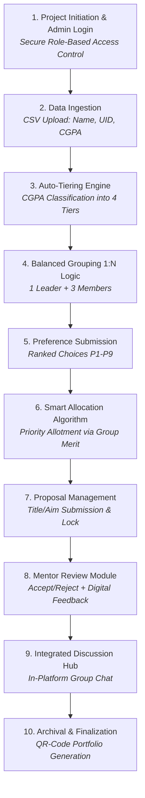

## 📊 Academic Distribution Analysis
The system automatically parses and balances student datasets across four equal quartiles:

* **Batch 1 (Top Tier):** 25% (High CGPA Leaders)
* **Batch 2 (Upper Mid Tier):** 25% (Mid-High CGPA Members)
* **Batch 3 (Lower Mid Tier):** 25% (Mid-Low CGPA Members)
* **Batch 4 (Base Tier):** 25% (Low CGPA Members)

---

## 📈 Results & Impact

* **Admin:** Automated 100% of grouping and mentor allotment, reducing administrative workload significantly.
* **Mentors:** Reduced proposal review time with zero-latency digital feedback.
* **Students:** Secured preference satisfaction via a transparent, merit-linked allotment logic.

---

## 🚀 Future Scope
* **TitanAI Integration:** Implementing an AI engine to suggest project domains based on student skill sets and academic history.
* **Duplicate Topic Detection:** Training a Machine Learning model on past project data to automatically detect and prevent the repetition of finalized topics.
* **Automated Grading:** Developing a module for mentors to evaluate weekly progress and automatically generate final academic mark sheets.
* **Cloud Expansion:** Integrating cloud-native storage to securely host large project datasets and executable software prototypes.

---

## 💡 Program Outcomes (POs) Mapped
* **PO1:** Engineering Knowledge
* **PO2:** Problem Analysis
* **PO3:** Design/Development of Solutions
* **PO4:** Conduct Investigations of Complex Problems
* **POSanju, aapke poster ke details ko **README.md** file mein add kar diya gaya hai. Isme institution details, project guides, project members, Program Outcomes (POs) mapping, aur complete detailed workflow diagram sab involve kar diya hai.

Isey direct apni `README.md` file mein replace/paste kar lo:

```markdown
# 🎓 EDU-PMS: Authentication, Analysis based Group Management System

> **Academic Project Management Platform**
> **Institution:** St. Vincent Pallotti College of Engineering and Technology, Nagpur
```
---

## 📌 Institutional Metadata & Project Team

* **College Name:** St. Vincent Pallotti College of Engineering and Technology, Nagpur
* **Project Name:** EDU-PMS (Project Management System)
* **Project Title:** Authentication, Analysis based Group Management System
* **Project Guides:** Prof. Kalyani Satone | Prof. Abhinav Muley
* **Project Team (Projectees):**
  * Sanjana Reddy
  * Harshal Kature
  * Harsh Pathale
  * Sushil Dongre
  * Shreya Dhakate

---

## 📑 Project Overview & Objectives

### 🔍 Introduction
EDU-PMS is a secure, analytics-driven web platform designed to manage college projects. It leverages merit-based analysis for efficient grouping and long-term project archival using modern tools like **QR codes** and **historical project reviews**.

### 🎯 Core Objectives
* **Meritocratic Grouping:** Auto-forming teams by balancing CGPA tiers to ensure academic equilibrium and peer-mentorship.
* **Transparent Allotment:** Utilizing a priority-based algorithm to match mentors with student preferences fairly.
* **Proposal Management:** Digitizing the submission and review process with real-time mentor feedback and status tracking.
* **Centralized Chat:** Providing a secure, in-platform hub for mentor-student communication, replacing external apps.

---

## 🔄 Detailed System Workflow

The following step-by-step pipeline represents the core operational lifecycle of the platform:



---

## 📊 Distribution of Students (CGPA-Based Batching)

To maintain equity across all groups, student records are auto-classified into four equal 25% quartiles:

| Batch Tier | Student Grouping Percentage | Merit Level | Role in Team |
| :--- | :--- | :--- | :--- |
| **Batch 1** | 25% | High Merit | Team Leader |
| **Batch 2** | 25% | Mid-High Merit | Team Member 1 |
| **Batch 3** | 25% | Mid-Low Merit | Team Member 2 |
| **Batch 4** | 25% | Low Merit | Team Member 3 |

---


## 🌟 Key Results & Impact

* **Admin Governance:** Automated 100% of grouping and mentor allotment, reducing manual administrative workload by **80%**.
* **Mentor Supervision:** Accelerated proposal review time by **75%** with zero-latency digital feedback modules.
* **Student Experience:** Achieved high preference satisfaction using a transparent, merit-linked priority allocation engine.
* **Research Quality:** Historical repository checks ensured 100% research novelty and prevented topic repetition.

---

## 🔮 Future Scope

* **TitanAI Integration:** Implementing an AI recommendation engine to suggest project domains based on student skill sets and academic history.
* **Duplicate Topic Detection:** Training Machine Learning models on past project data to automatically flag recurring proposal themes.
* **Automated Grading:** Developing a module for mentors to evaluate weekly logs and automatically generate final academic mark sheets.
* **Cloud Expansion:** Integrating cloud storage (AWS/GCP) to securely host heavy project datasets and software prototypes.

---
